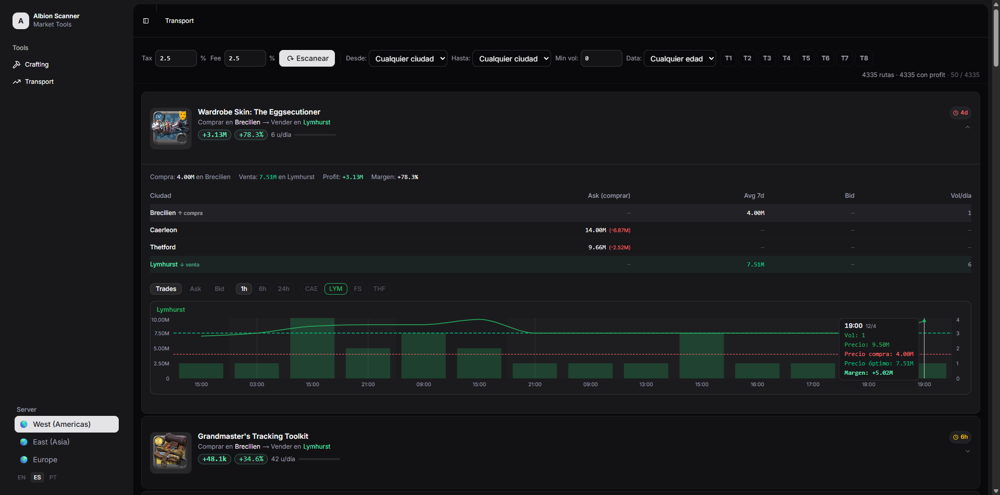
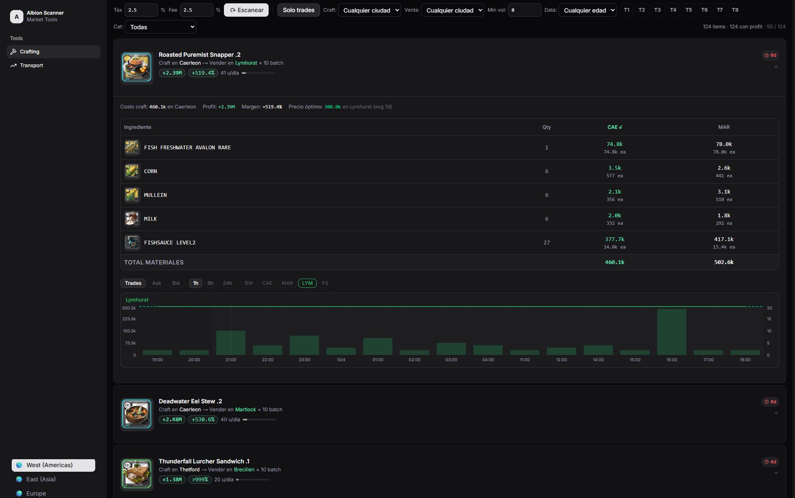
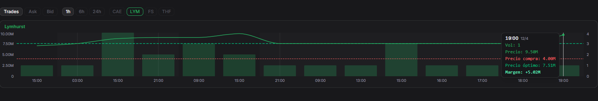

# MarketScout — Albion Online

Real-time market scanner for Albion Online. Shows the best transport routes between cities and the most profitable items to craft, based on actual trade history — not just posted listings.

**Live demo:** https://albion.codea.plus

---

## What it does

### Transport Routes
Find items where the price difference between two cities is large enough to profit after taxes and listing fees. Routes are ranked by a score that weighs profit, daily volume, and how recent the data is — so you always see the most actionable opportunities at the top.

### Crafting Routes
See which items are worth crafting right now in each city, based on ingredient cost vs. sell price. Filtered by crafting city and sorted by profitability.

### Price History
Check how an item's price has moved over time in any city. Useful for spotting trends before committing to a route.

---

## Features

- Covers all major cities: Caerleon, Bridgewatch, Fort Sterling, Lymhurst, Martlock, Thetford, Black Market
- Supports all three servers: 🌎 West (Americas) · 🌏 East (Asia Pacific) · 🌍 Europe
- Data refreshes every 15 minutes
- Ghost price filtering — meme listings like `9,999,999` are automatically excluded
- Server selection persists across sessions

---

## Data source

All data comes from the [Albion Online Data Project (AODP)](https://www.albion-online-data.com/), a community-run public API. No game client modification or private API access is used.

---

## Try it

The scanner is running live at **https://albion.codea.plus** — no login required, just open and use.

This is a proof of concept. If you find a bug or have a suggestion, open an [issue](https://github.com/PandasCoder/market-scanner/issues) or leave a comment.
